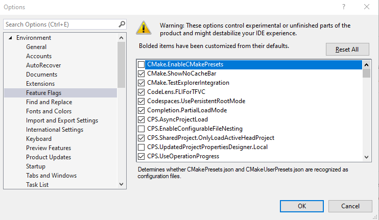

# FeatureFlags
A Visual Studio extension for viewing and controlling feature flags

## Getting Started
Download and install the extension from the Visual Studio Marketplace.

_Note: This extension collects and transmits anonymized usage statistics to the extension author for product improvement purposes._

Access the "Feature Flags" page from Tools/Options...

